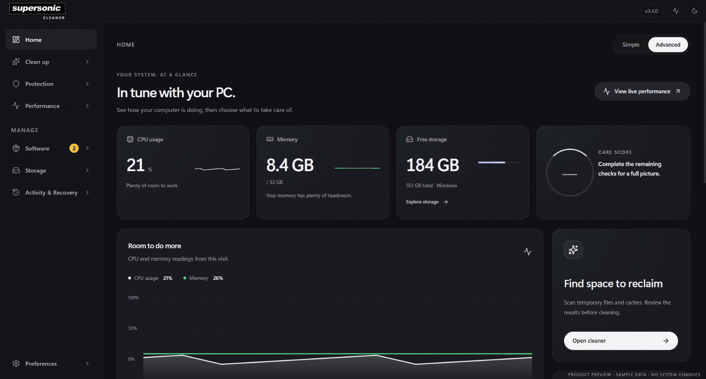
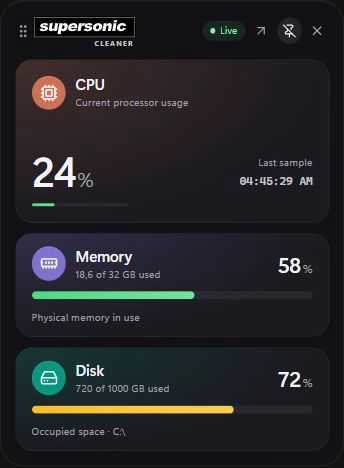

<p align="center">
  
</p>

<h1 align="center">SuperSonicCleaner</h1>

<p align="center">A local, open-source system cleaner and performance workspace for Windows, macOS, and Linux.</p>

<p align="center">
  <a href="https://github.com/leonardostagliano/SuperSonicCleaner/releases">Releases</a> ·
  <a href="RELEASE.md">Install and update</a> ·
  <a href="CLI.md">CLI</a> ·
  <a href="https://github.com/leonardostagliano/SuperSonicCleaner/issues">Issues</a>
</p>



_Captured from the browser preview with synthetic data. Measurements, scan results, AI reports, and the available update are demonstrations._

SuperSonicCleaner is an independent fork of [Kudu](https://github.com/AdventDevInc/kudu), originally developed by Advent Development Inc. It has its own identity, settings profile, and release channel; it is not an official Kudu release. The application does not require a remote account or subscription for its local tools.

## What you can do

- **Clean with review:** scan system, browser, application, and game caches; inspect categories and selections before removal. Schedule supported care tasks and review activity and recovery options.
- **Understand storage:** explore disk usage, find duplicates, large files, and empty folders, and compare storage snapshots over time.
- **Watch performance:** inspect live CPU, memory, disk, and process activity. Record a diagnostics session and generate a local report that remains available without AI.
- **Keep a small monitor nearby:** enable the draggable desktop notch from the title bar to see CPU, physical memory, and occupied disk space. It hides while the main window is visible; its position and pinned state are saved. Reopen the app through the notch, tray menu, or normal desktop entry points.
- **Choose an appearance:** use the compact Simple home or detailed Advanced home in a [graphite and light design system](docs/DESIGN_SYSTEM.md). The wordmark and icons draw on classic Oasis-inspired black-and-white typography.
- **Use platform tools:** manage startup entries and installed software, check software updates, and use the protection and maintenance tools available on your operating system.

Scans, recordings, and AI analysis keep their progress when you switch views. Return to the tool to review the current operation or its saved result.

The app ships a broader set of translated interface strings, while newly added views currently provide English and Italian text with English fallback for other languages.

### Desktop monitor



_Sample data. The disk reading is occupied space on the selected system volume, not disk input/output. Drag the handle to move the notch; pin it to keep the expanded view open._

### Platform coverage

| Capability | Windows | macOS and Linux |
| --- | --- | --- |
| Cleaner, storage discovery, live performance, diagnostics, and local reports | Available | Available |
| Registry, driver updates, bloatware removal, Game Mode, firewall audit, and context-menu cleanup | Available | Windows-only tools are hidden |
| System repair, restore points, and boot tracing | Available where supported by Windows | Windows-only |
| Malware scanning | Local checks; cached YARA rules if present | Local checks; cached YARA rules and configured native integration when available |

Tool behavior can depend on permissions, installed system utilities, and the selected files or drives. The malware scanner is a bounded local check, not a whole-disk antivirus replacement. It does not ship or download YARA rules: a new profile has **no YARA signature coverage** until compatible local rules are present. Windows Defender operates separately. See [malware scanning and coverage](docs/MALWARE_SCANNING.md).

## Optional Codex analysis and privacy

To investigate a slowdown, open **Performance > Diagnostics**, finish a recording, and select it. Choose **Analyze recording** for a local report, or enable **Codex performance analysis** and choose **Run Codex analysis** for the optional AI report.

AI analysis is off by default. Each analysis requires an explicit action and uses your existing local Codex sign-in; SuperSonicCleaner does not copy its credentials. Local scans, cleanup, and diagnostics remain usable without Codex. AI recommendations are advisory and never select or delete files for you.

For cleaner, large-file, duplicate, and disk results, the app samples at most 100 displayed candidates. It sends temporary IDs, broad file types, sizes, and coarse age buckets through a restricted request gateway. **File names, paths, contents, hashes, and raw extensions are not sent.** The temporary IDs are resolved to names only in local memory. File-analysis requests and recommendations are not saved by the app.

For a saved performance recording, Codex receives bounded **numeric measurements** such as relative sample times, CPU and memory values, and disk throughput. Process measurements use new opaque IDs. Process names, PIDs, commands, recording titles and notes, dates, paths, and file contents are excluded. The local report and optional AI report are separate; validated AI reports are saved with the recording in encrypted local storage. An explicit JSON export is unencrypted and may include locally recorded process names. See the [full AI data boundary](docs/AI_ANALYSIS.md).

File access time is only a filesystem metadata indication. It may be missing, delayed, disabled, or changed by another program; it does not establish when a person last opened a file. SuperSonicCleaner does not recommend deletion based on that timestamp alone.

## Install and updates

Get a **SuperSonicCleaner** package from [this fork's GitHub Releases](https://github.com/leonardostagliano/SuperSonicCleaner/releases). Verify the product name on the asset: inherited Kudu tags or packages are not releases of this fork. The [release guide](RELEASE.md) explains availability, checksums, signing, and update behavior.

| System | Configured packages | Update path |
| --- | --- | --- |
| Windows x64 | NSIS installer, portable EXE and ZIP | Installed copy: in-app updater; portable copy: replace manually |
| macOS Intel / Apple Silicon | DMG and ZIP | In-app updates require a properly signed installed app |
| Linux x64 / arm64 | AppImage and DEB | AppImage: in-app updater; DEB: system package manager |

The installed app checks this fork's GitHub release feed. About shows available versions, release notes, and download progress; the restart to install is under your control. Background download can be configured in Settings. The Windows installer requests administrator permission for system tools. First install creates a separate SuperSonicCleaner profile and does not replace or import an upstream Kudu installation. Published packages may be unsigned until signing is configured; consult the release guide for platform restrictions.

## Develop

Use the Node.js version in [.nvmrc](.nvmrc) (currently 24) and run:

```sh
npm ci
npm run dev
```

Build the Electron app with `npm run build`, or create a platform package with `npm run package:win`, `npm run package:mac`, or `npm run package:linux` on the corresponding build host. Before committing, run `npm run check` for type checking, lint, formatting, rule validation, and tests. For the browser-only sample interface, run `npm run dev:ui` and open `http://127.0.0.1:5186/ui-preview.html`. See [contributing](CONTRIBUTING.md) and the [cleaner rules guide](rules/RULES.md).

## License and attribution

SuperSonicCleaner is distributed under the [MIT license](LICENSE). The original Kudu copyright notice, **Copyright (c) 2026 Advent Development Inc**, remains in the license and distributed packages. This fork's branding, interface, privacy controls, and release work are maintained in this repository. Review any proposed cleanup before applying it; the software is provided “as is” under the license.
